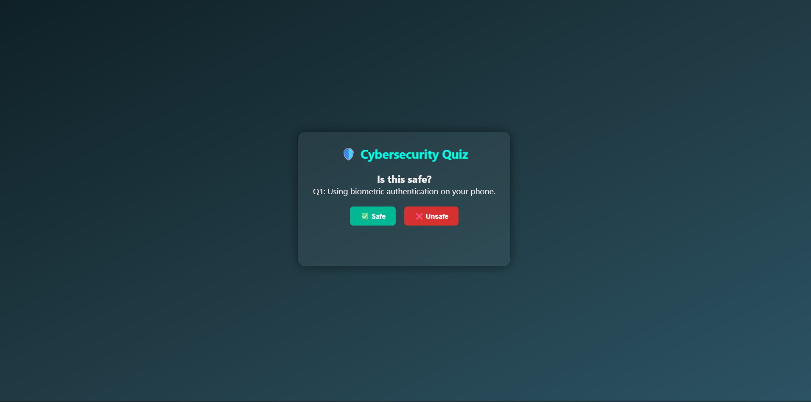
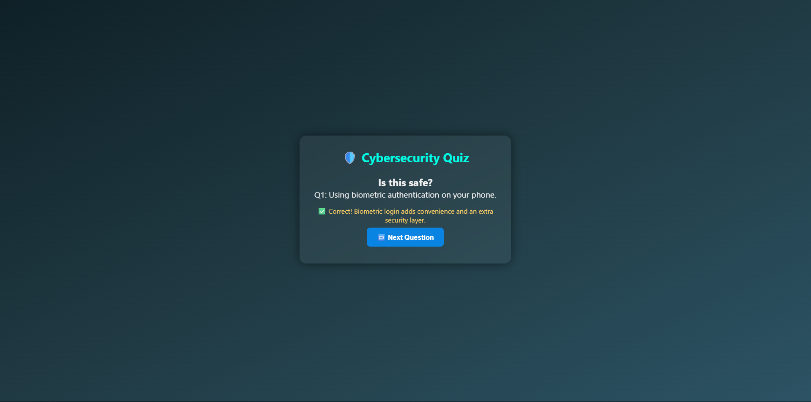
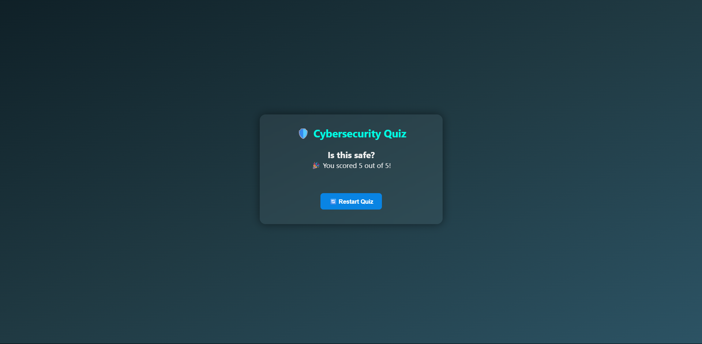

# NFC Cybersecurity Quiz

A simple online quiz to test your cybersecurity knowledge.  
Works great when accessed via NFC tags or directly in a browser.

---

## How to Use

1. Scan the NFC tag or open the website link.  
2. Read each question carefully.  
3. Choose **Safe** or **Unsafe**.  
4. Get instant feedback on your answer.  
5. See your total score at the end.

---

## Screenshots

### Question  

### Feedback  

### Final Score  

---

## Customize

- Edit `quiz.json` to add or change questions.  
- Change colors and fonts in `style.css`.

---

## License

MIT License — free to use and share.

---

Created by [Your Name]

